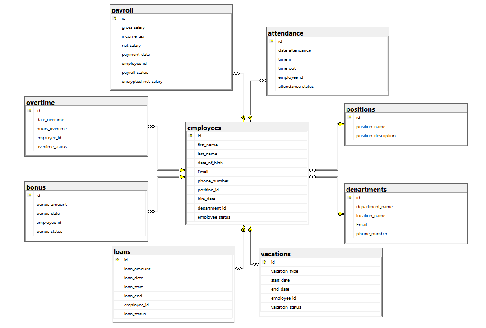

# HR Management Database

This repository contains a comprehensive SQL-based project designed to manage the Human Resources (HR) operations of an organization. The project includes scripts for creating database schemas, managing user roles, performing data encryption, indexing queries for performance optimization, and more. Below is an overview of the contents and purpose of each file in this repository.

## Table of Contents

1. [Database Schema Creation](#database-schema-creation)
2. [HR Entity Relationship Diagram (ERD)](#hr-entity-relationship-diagram-erd)
3. [Data Analysis Queries](#data-analysis-queries)
4. [DDL and DML Commands](#ddl-and-dml-commands)
5. [Indexing Queries](#indexing-queries)
6. [SQL Views Creation](#sql-views-creation)
7. [Database Encryption and Decryption](#database-encryption-and-decryption)
8. [User Role Management](#user-role-management)
9. [SQLServer Backups](#sqlserver-backups)

## Database Schema Creation

This file (`Database_Schema_Creation.sql`) contains the SQL scripts necessary to create the foundational structure of the HR database. It includes the creation of tables such as `employees`, `departments`, `positions`, and others, along with primary keys, foreign keys, and constraints.

## HR Entity Relationship Diagram (ERD)

The diagram below represents the Entity Relationship Diagram (ERD) for the HR Management Database. It visualizes the relationships between various entities (tables) within the database, illustrating how they are interconnected.

### Key Components:

- **employees**: This central table stores information about employees, including their name, contact details, position, department, and status.
  - Connected to multiple tables representing various aspects of employee management (e.g., payroll, attendance, loans).
  
- **departments**: Holds details about the different departments within the organization, including the department name, location, and contact information.
  
- **positions**: This table stores the various job titles within the company, along with descriptions.
  
- **payroll**: Contains payroll details such as gross salary, income tax, and net salary for employees.
  
- **attendance**: Tracks employee attendance, including check-in and check-out times.
  
- **vacations**: Stores records of employee vacations, including vacation type, start and end dates, and approval status.
  
- **loans**: Manages details of loans given to employees, including loan amounts, dates, and statuses.
  
- **overtime**: Tracks overtime hours worked by employees, including the date and hours worked.
  
- **bonus**: Records bonuses awarded to employees, including the amount, date, and status of each bonus.

Each table is linked to the `employees` table via foreign keys, establishing a clear and well-defined structure that supports comprehensive HR management and reporting.

## Data Analysis Queries

The `Data_Analysis_Queries.sql` file contains various SQL queries aimed at analyzing data within the HR database. It includes queries for reporting the number of employees per department, calculating total salaries, tracking attendance percentages, and more.

## DDL and DML Commands

In the `DDL_and_DML_Commands.sql` file, you will find scripts that include Data Definition Language (DDL) and Data Manipulation Language (DML) commands. These scripts handle tasks such as creating, altering, and deleting tables, as well as inserting, updating, and deleting data records.

## Indexing Queries

The `Indexing_Queries.sql` file includes SQL scripts for creating indexes on various tables to optimize query performance. Indexes are created for fields that are frequently queried to ensure efficient data retrieval.

## SQL Views Creation

The `SQL_Views_Creation.sql` file contains scripts for creating various SQL views. These views provide pre-constructed queries to display specific datasets, such as employee payroll details, bonuses by department, attendance records, and more.

## Database Encryption and Decryption

The `Database_Encryption_and_Decryption.sql` file outlines the steps to secure sensitive data within the HR database. It includes scripts for creating encryption keys, certificates, and the encryption/decryption of salary information stored in the database.

## User Role Management

This file (`User_Role_Management.sql`) contains scripts for managing user roles and permissions within the HR database. It includes commands for creating roles, granting and revoking permissions, and managing user access to various parts of the database.

## SQLServer Backups

The `SQLServer_Backups.sql` file provides scripts for performing different types of backups for the HR database, including full backups, differential backups, and transaction log backups. These scripts ensure that the database can be restored to a consistent state in case of data loss.

## Getting Started

To get started with this project:

1. Clone this repository to your local machine.
2. Review the SQL scripts to understand the database structure and operations.
3. Execute the scripts in your SQL Server environment to create and manage the HR database.
4. Use the provided views and queries to analyze data and generate reports.
5. Secure sensitive data using the encryption scripts and manage user access through the role management scripts.

## Contributing

If you have suggestions for improvements or encounter any issues, feel free to create a pull request or raise an issue in this repository. Contributions are welcome!

